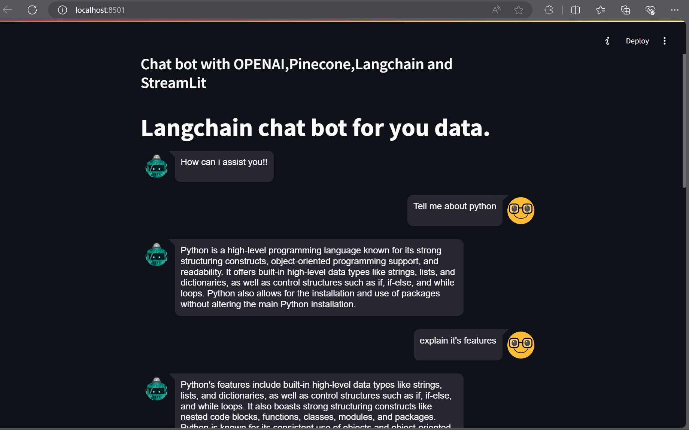

# Chat bot with OPENAI,LANGCHAIN,Pinecone and Streamlit 

1) First perform loading document loading and convert data into data chunks and store in vector store in ipynb file.
2) Create a app.py and create streamlit configuration.
3) Create a utils.py having get_conversation_string,query_refiner,find_match.
 * get_conversation_string - is a function that constructs a conversation string by iterating through the requests and responses stored in st.session_state. The function appends each user's request and the corresponding bot's response to the conversation_string variable.
 * query_refiner - query_refiner(conversation, query), is a function that uses the OpenAI GPT-3.5-turbo model to refine a user query based on a given conversation log. The function takes two parameters: conversation, which is a string representing the conversation log, and query, which is the user's original query.
 * find_match - This function is responsible for finding relevant information or context from a knowledge base based on the input provided.

# Screenshot of chat bot 

* As you can see it is having buffer memory by making of previous question by linking it to the current question of it.